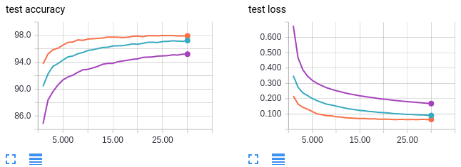
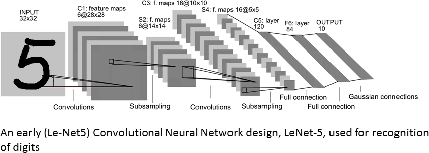
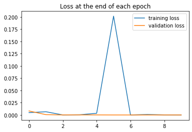
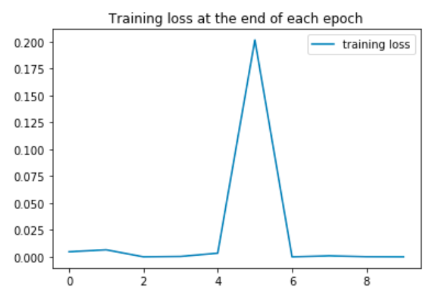
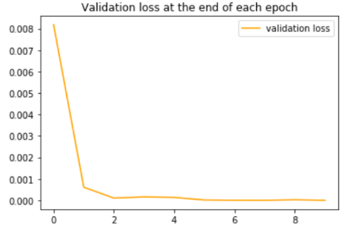
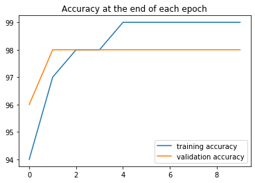
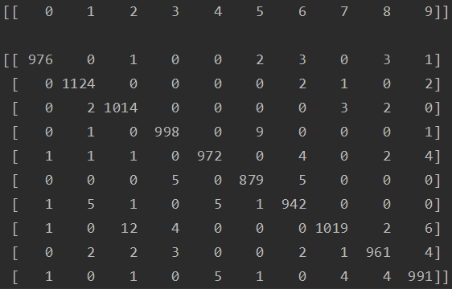
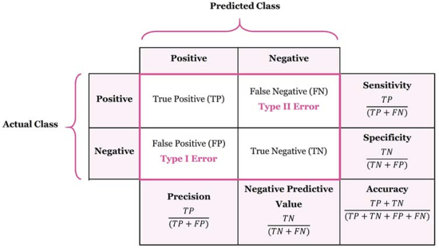
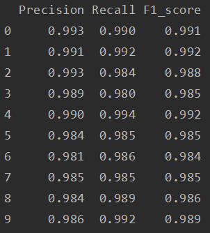

# MNIST Dataset: Convolution Neural Network (CNN) Classifier

**Summary:** This project aims to classify images of handwritten numbers correctly. The approach taken is using a Convolution Neural Network consisting of two layers of Convolution and pooling layers, followed by three fully conected layers. This architecture achieved 98.760% accuracy after running for 10 epochs with a small batch size of 10. While the classifier produced consistent predictions, there were more incorrect results on numbers with similar handwritten shapes as evidenced by the higher instances of predicting 7 as 2. Besides Accuracy, Precision, Recall and F1_score were used as evaluation metrics as well. The scores from these metrics are consistent and showed minute differences from each other.

## Table of contents
1. [Usage](#usage)
2. [Preparation of MNIST Dataset](#dataprep)
3. [CNN Design](#approach)
4. Results
	1. [Accuracy](#acc)
	2. [Misses](#misses)
	3. [Precision, Recall & F1-score](#pre_rec_f1)
5. [Future Work](#future_work)

## <a name="usage"/>Usage

Training of the model can be done by running:
	
	python main.py

Training and testing batch sizes, learning rate (lr) and number of epochs can be configured using parameters.py located under config folder.

For every run:
* Model will be saved under this directory: CNN_MNIST/saved_model/run_(run number) with format as "MNISTDatasetModel_epoch_(epoch number).pt"
* Evaluation Metrics of Precision, Recall and F1-score are saved under results folder as "run_(run number).csv"

Details on data preparation, cnn_design and results can be found bellow.

## <a name="dataprep"/>Preparation of MNIST Dataset

The MNIST database is available [here](http://yann.lecun.com/exdb/mnist/).

The MNIST database is a dataset of handwritten numbers containing 60,000 training samples, and 10,000 test samples. The images are grayscale, measuring 28x28 pixels.

The MNIST train and test datasets available through torchvision. To download the dataset: 

	transform = transforms.ToTensor()
	training_dataset = datasets.MNIST(root='../Data', train=True, download=True, transform=transform)
	testing_dataset = datasets.MNIST(root='../Data', train=False, download=True, transform=transform)	

The datasets will be downloaded into the path specified when running for the first time. For subsequent calls, torchvision will look for a local copy before attempting another download.

Next, the training dataset is split into training (50k images) and validation sets (10k images):

	train_data, val_data = torch.utils.data.random_split(training_dataset, [50000, 10000])

Finally, all of the datasets are loaded using Dataloader:

    train_loader = DataLoader(train_data, batch_size=train_batch_size, shuffle=True)
    val_loader = DataLoader(val_data, batch_size=test_batch_size, shuffle=False)
    test_loader = DataLoader(test_data, batch_size=len(testing_dataset), shuffle=False)	

Additionally, Kevin Shen's experiment ([link](https://medium.com/mini-distill/effect-of-batch-size-on-training-dynamics-21c14f7a716e)) for the MNIST dataset discovered that smaller training batch sizes produced higher accuracy within the same number of epochs. Batch size is the number of samples used to train a model before updating of the weights and biases. In every training step, a batch of samples is ran through the model and then propagated backwards to get the gradients which are used to update the parameters. 

 *Figure 2.1: Batch size against Test Accuracy and Loss*

* Orange curves: batch size 64
* Blue curves: batch size 256
* Purple curves: batch size 1024
 
Using a smaller batch size results in a less accurate estimate of the error gradient that is highly dependent on the specific training examples used.This results in a noisy estimate that, in turn, results in noisy updates to the model weights. However, noisy updates can result in faster learning and sometimes a more robust model, offering a regularizing effect and lower generalization error. In a way, smaller batch sizes allow the model to “start learning before having to see all the data.” 

In contrast, using a larger batch size would mean that a larger number of samples is used to estimate the error gradient before the model weights are updated. For instance, if the entire dataset was used as the batch size, each gradient descent step is using the entire dataset. However, doing so often leads to poor generlisation. According to the research paper "On Large-Batch Training for Deep Learning: Generalization Gap and Sharp Minima", the lack of generalization ability is because large-batch methods tend to converge to sharp minimizers of the training function. Generalisation is about the model's ability to correctly gave predictions on previously unseen data.

This explains why a smaller batch size of 64 produces a higher testing accuracy as compared to those of larger batch sizes, especially so for the run using 1024 batch size. While batch size of 256 achieved lower overall validation accuracy, the results are still close, but a batch size of 1024 proved to be too large and lead to poorer results. In this case, a small batch size of 10 was used as a starting point.

## <a name="approach"/>CNN Design
According to Chris Deotte's research ([kaggle link](https://www.kaggle.com/c/digit-recognizer/discussion/61480)), the best approach is to start with convolution layer, followed by a pooling layer. Then repeat this again. Finally, add Dense layers and finish up with softmax.

Convolution layers contains a set of filters with smaller dimensions than the input volume. A convolution is a linear operation that involves sliding the filter across the width and height of the input according to the stride size (number of pixels to shift the filter by) specified and the dot products between the input and filter are computed at every position to produce an activation map. In this case, Convolution preserves the relationship between pixels by learning image features using small squares of input data, while reducing the number of parameters.

Deotte’s investigation determined that 2 layers is the best which corresponded to the LeNet5’s architecture of 2 layers of convolution. After 3 layers of convolution and pooling, the input image is left with a small size of 3 x 3 without padding, making it unrealistic to have more than 3 layers. Furthermore, 6 feature maps is used for the first convolution layer followed by 10 feature maps for the second layer, then followed by 2 fully connected layers of 120 nodes and 84 nodes, respectively, following LeNet5’s architecture. I have chosen this architecture, as it is proven to achieve >98% accuracy after running for 10 epochs with Pytorch by Ankush Choubey.

Max Pooling was chosen as the pooling layer as it returns the maximum value from the portion of the image covered by the filter. For instance, for a 2 by 2 max pooling layer, if the sample area is [[3, 6], [7, 0]] , we will take the value of 7  which is the maximum for that 2 by 2 area of the convolved feature. This way, the number of parameters and computation by is reduced, while capturing the most important features from each patch of 2 by 2 of the feature map. This provides a summarized version of the largest/most dominant features detected in the input and thus selects the brighter pixels from the image. It is useful when the background of the image is dark and we are interested in only the lighter pixels of the image, which is ideal for the MNIST dataset as the digits are represented in white color and the back ground is black.

Thus, these are the following layers:

 *Figure 3.1: CNN Design for MNIST dataset, Source: [LeNet5](https://www.researchgate.net/figure/The-architecture-of-LeNet-5-23-a-CNN-used-for-digits-recognition-for-the-MNIST-dataset_fig2_321665783/download)*

## Results
### <a name="acc"/>Accuracy
The final testing accuracy is 98.760% after running for 10 epochs.

 *Figure 4.1: Loss against Epoch graph*

 *Figure 4.2: Closer look into Training Loss*

 *Figure 4.3: Closer look into Validation Loss*

The peak in epoch 5 may be a result of using the Adaptive Moment Estimation (Adam) optimizer. Adam uses estimations of first and second moments of gradient to adapt the learning rate for each weight of the neural network. To estimates the moments, it utilizes exponentially moving averages, computed on the gradient evaluated on a current mini-batch.

The equations for Adam optimizers are:

    t <- t + 1
    lr_t <- learning_rate * sqrt(1 - beta2^t) / (1 - beta1^t)
    m_t <- beta1 * m_{t-1} + (1 - beta1) * gs
    v_t <- beta2 * v_{t-1} + (1 - beta2) * g * g
    new_variable <- variable - lr_t * m_t / (sqrt(v_t) + epsilon)

where m is an exponential moving average of the mean gradient and v is an exponential moving average of the squares of the gradients. beta1 and beta2 represents the exponential decay rates for moment estimates m and v. t represents the current timestep, g represents the gradient of the loss function at the timestep t.

When the training of the model has been going on for a long time (in this case the 6th epoch), the gradient can get really small and the whole of denominator(sqrt(v_t) + epsilon) will be small. If the gradient starts increasing again, due to having a few batches of data that fits very badly, then the value can blow up, resulting in a much higher loss, since m changes much more quickly than v (default values of beta1=0.9 & beta2=0.999) and can start being big again while v is still small and cannot catch up.

In this case, although the training loss is quite high for that epoch, the testing accuracy did not have much of a big difference, however, there was also a slight dip in validation accuracy, which took another one or two training batches of the next epoch to get back on track. In such a case, it does not really make that much of a difference, as the validation accuracy appears to have plateau off already.

A plausible solution to this is to increase epsilon value which is 10^-8 by default, so that the denominator with v is not too small. Decay values are used in computing the moving averages, and could be adjusted to influence the m and v values such that sqrt(v) is not too small. Lastly, the learning rate can also be adjusted, as sometimes, having too large a learning rate and will diverge and fail to find the minimum of the loss function, leading to increased loss.

Running with other optimizers without Adam’s property of momentum like SGD without momentum is also a viable solution to reduce the loss spikes.

 *Figure 4.4: Accuracy against Epoch graph*

From the plotted graph (fig 4.4), the training accuracy presents an upwards trend until epoch 4, which it then starts to plateau. Similarly, the validation loss increases as well before plateauing, however, it has reached its peak after just running 2 epochs. It is also to be noted that the validation accuracy remains higher than the training accuracy for the first two epochs. Lastly, both initial training and testing accuracies started out at an already very high value of >90% after the first epoch.

Validation accuracy will be usually less than training accuracy because training data is something which model is already familiar of and validation data is a collection of new data points which is new to the model. Having an initial higher accuracy could be attributed to the MNIST dataset having with a smaller variance between its classes as it contains images of numbers which despite being handwritten looks very similar (having little variance in features) to other numbers belonging to the same class. This also makes the validation dataset vary little as it was split from the training dataset and thus, produce a higher accuracy because it is easier to correctly predict the digits with an “easier” dataset. The rapid peaking of the validation accuracy can also be explained the same reasoning, as it is easier to fit training datasets with little variance, thus the model achieved its peak performance faster. 

Although the training accuracy continue to increase for another 2 to 3 epochs, it also plateaus within 5 epochs and reached its peak training accuracy at around 99%. While there is a noticeable difference between the validation accuracy and training accuracy, the difference is less than 1% and the training loss and validation loss remained relatively like each other (excluding the peak in training loss in epoch 5). Therefore, this tells me that the model has fitted well relatively quickly, and further training of the model will not be required after epoch 4.

Final testing accuracy of 98.76% was obtained.

### <a name="misses"/>Misses
From the confusion matrix below, for all classes of numbers, an overwhelming majority is classified correctly.

 *Figure 4.5: Confusion Matrix of Ground Truth against Predicted Digits*

This confusion matrix (fig 4.5) is obtained by counting all the instances of each digit is being classified into the 9 kinds of digit classes.

Generally, for all classes of numbers, an overwhelming majority is classified correctly (the diagonal strip in the matrix that has a high number of cases), from the high testing accuracy obtained by the model.

Most of the wrongly classified instances have 5 or less cases. However, there is a significant number of cases where the number “7” is wrongly classified as “2” (12 cases), and “3” being classified as “5”, as compared to the rest. A plausible reason could be due to the similar shapes between the two pairs of numbers. "7" looks like "2" with an additional horizontal stroke at the bottom and “3” will look like “5” when written in with its top curve straightened out. 

Thus, the model had a bit more difficulties telling these similar two numbers apart, as these numbers have similar features when handwritten.

### <a name="pre_rec_f1"/>Precision, Recall & F1 Score

 *Figure 4.6: Precision and Recall Formula*

Besdies Accuracy, Precision, Recall and F1-score was also looked into as evaluation metrics.

#### Precision and Recall
In multi-class classification problems, precision of each class is calculated as the sum of true positives across a class divided by the sum of true positives and false positives across the same class. Precision evaluates the fraction of correct classified instances among the ones classified as positive. making it an useful metric for evaluation of models that were trained on imbalanced classes.

On the other hand, Recall quantifies the number of correct positive predictions made out of all positive predictions that could have been made.
Recall provides an indication of missed positive predictions.

Thus, Precision and Recall serve different functions:
* Precision: Appropriate when minimizing false positives is the focus.
* Recall: Appropriate when minimizing false negatives is the focus.

Both of these metrics are useful for evaluation of models that were trained on imbalanced classes, since they consider false positives and false negatives respectively, rather than the raw accuracy which can be incorrect when datasets are imbalanced (containing a very few instances of a class type or large instances of of a class type) .

#### F1-score
F1-score provides a way to combine both precision and recall into a single measure that captures both properties. It is the harmonic mean of the two fractions, weighing both precision and recall equally:

	F1-score = (2 * Precision * Recall) / (Precision + Recall)

 *Figure 4.7: Precision, Recall, F1-scores*

In this case, Precision, Recall and F1-scores are all very high and varied little accross the board as the classes are well balanced and the cases of wrong classifications are minute compared to correctly classified cases (Accuracy > 98%). 

## Future work:

Data Augmentation could be done to investigate if a larger dataset would make the model better at telling numbers of similar shapes apart.

For instance, the images could be shifted or rotated to generate more images that will provide more details for the model to work on.
  